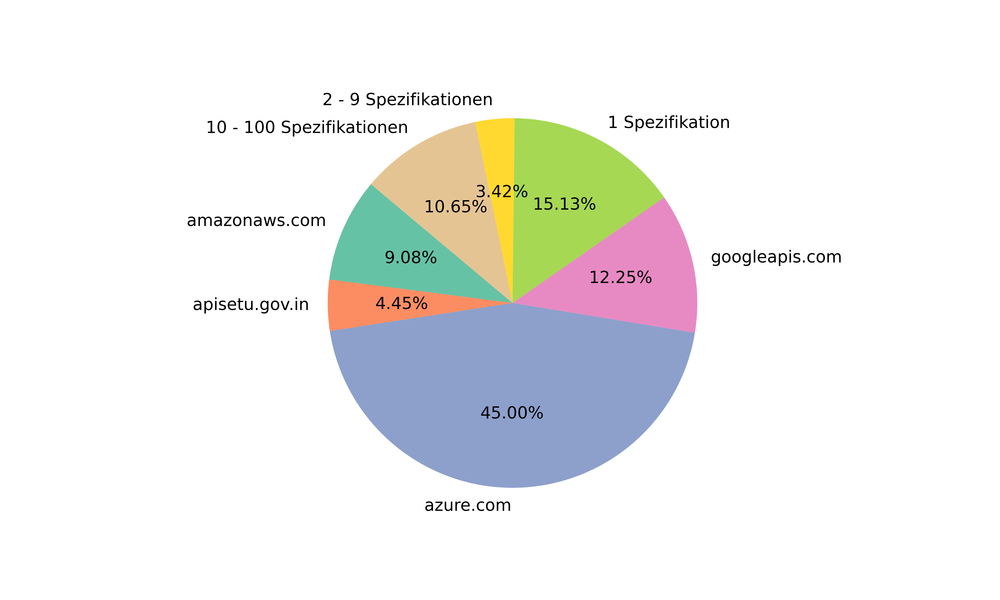
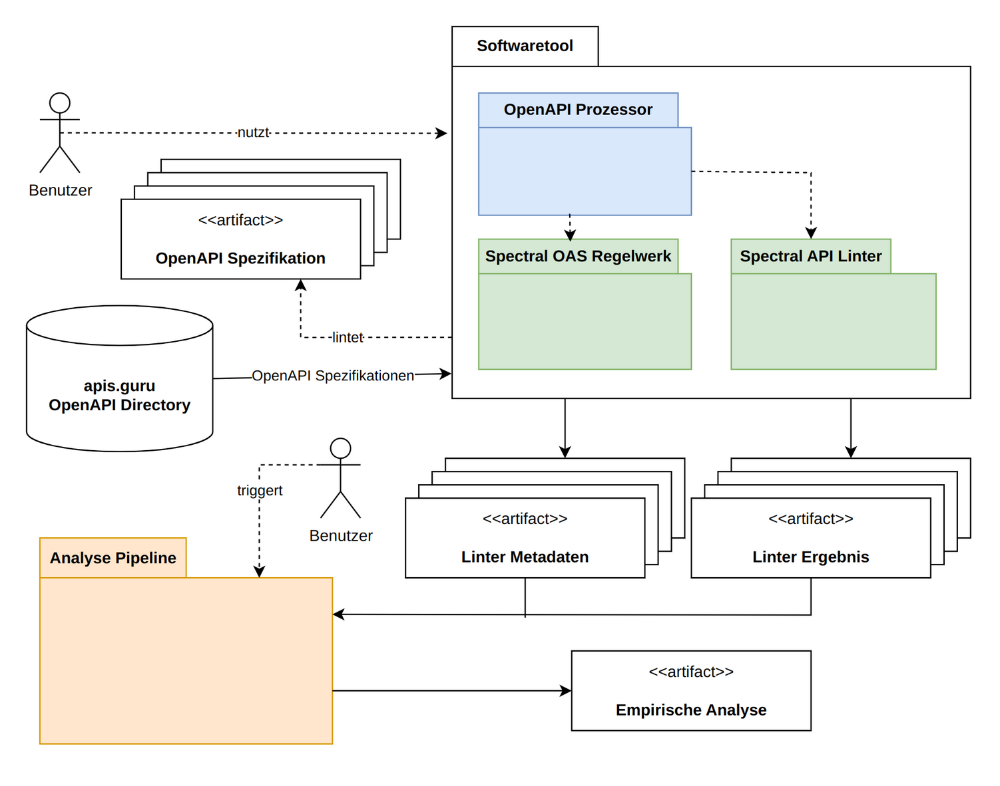
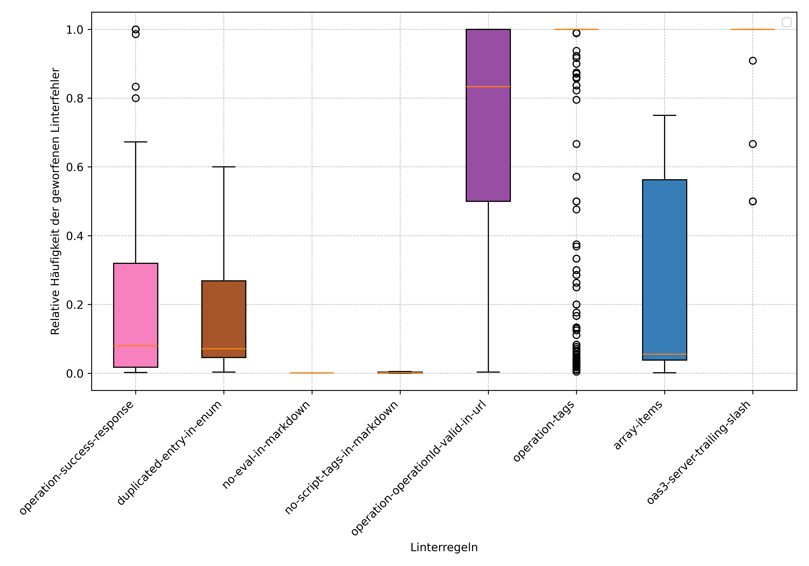
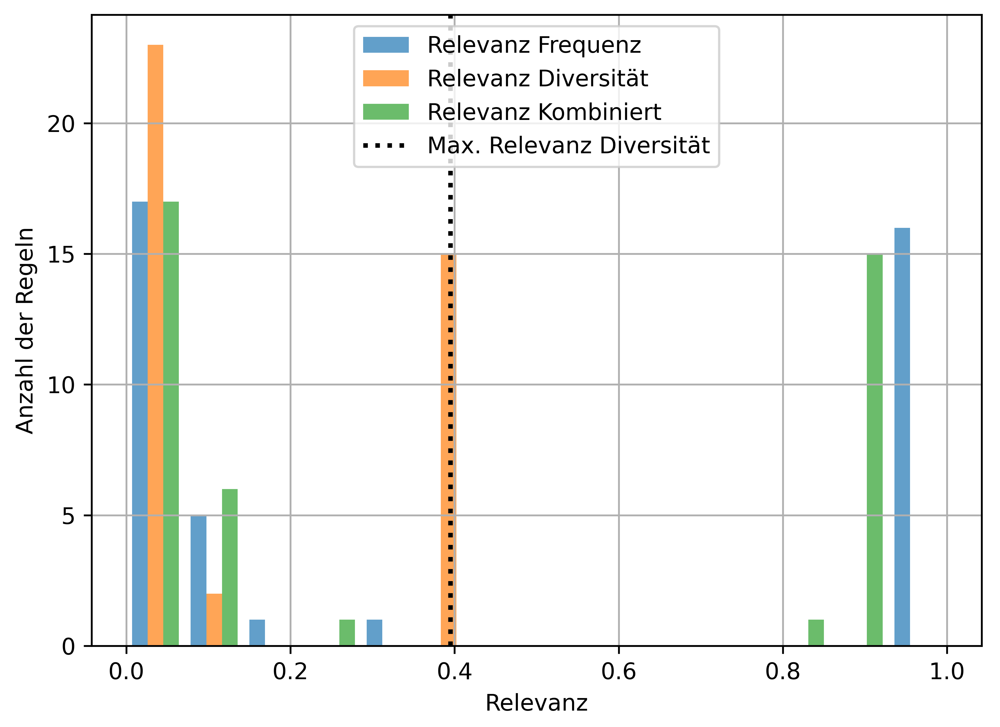

<!-- LTeX: language=en -->

# Relevanz von Linterregeln für die Qualität von OpenAPI Spezifikationen

## Table of Contents

1. [Motivation](#motivation)
2. [Introduction](#introduction)
3. [Method](#method)
4. [Results](#results)
5. [Summary](#summary)
6. [Repository](#repository)
7. [Releases](#releases)

## Motivation

- **Problem:** Linting OpenAPI Specifications with the Spectral API Linter can be complex. Developers need to decide which rules are relevant for the individual needs of each project to meet their quality objectives.
- **Goal:**
  - simplify linter configuration decisions
  - Improve software and interface quality
  - save developer time
- **Method:** Re-prioritize existing default linter rules to match standards of and existing web-standard of OpenAPI specifications.

## Introduction

OpenAPI is the de-facto standard to document HTTP APIs on the internet. An OpenAPI Specification document is a structured `.yml` or `.json` document describing capabilities of a service without exposing underlying source code. Implementation instances greatly vary in depth, quality and accuracy in how well and to what detail they describe a service.

The Spectral OpenAPI Linter is a tool for static code analysis that targets OpenAPI Specification documents to verify adherence to the OpenAPI standard. Spectral defines a default ruleset for OpenAPI and optionally enables users to implement own rulesets for individual needs. The tool defines three severity levels for linter errors: `error`, `warn`, `hint`.

The objective of this thesis was to find out to what extent the default ruleset is adhered to by real world APIs. In other words whether its rules are actually relevant to a common web standard.

As data source for a common web API standard the _APIs.guru_ online repository was used which contains high quality real-world curated specifications.

_This plot shows the content division of specification providers in the APIs.guru dataset_

## Method

A software tool was built to run the linter for all specifications in the APIs.guru repository. Three different classes of linter rules were identified. These are important to find out the amount of thrown in relation to possible errors. This proportion rate is called _inverted linter results_ throughout the thesis.

1. **Single Trigger** A rule can be triggerd once per specification
2. **Multi Trigger** A rule can be triggered n times per specification
3. **Multi Message** A rule can be triggered n times per specification with m possible error messages

_Diagram shows software architecture context view of the components of the tool_

## Results

The amount of recorded linter messages totalled 929,699 errors thrown on 7,778,972 possible places for linter errors meaning that about 12% of linter targets actually threw an error. As implementation complexity for _Multi Message_ linter rules grows a lot only Single Trigger and Multi Trigger Rules were investigated regarding this feature. Results show that if a Multi message rule is triggered it throws either close to allways in a specification or almost never. This implys that rules adherence and violations are not at random but consistent along implementations.

_Proportion of violations of multi trigger linter rules_

To map rules to relevance two relevance metrics are used. Each rule relevance is thus represented by a R+² vector. Both metrics are normalized to the interval [0,1) the higher the value, the larger the relevance estimate.

The first metric is based on the Inverse Document Frequency (IDF), classifying relevance by relative amount of specifications that triggered an error.

The second metric uses the Jaccard Distance to compare rule triggering patterns. If findings for a rule are similar throughout all specifications, consensus amongst developers is high meaning thrown errors for a rule are less relevant. However, a unique, random pattern implies ingenious outliers meaning the linter findings are more relevant.

Both metrics separate the rules clearly into two groups: Rules that are relevant and rules that are not relevant.

_Histogram relevance of rules_

This enables an efficient re-matching of the rules priorities. Not relevant rules can be matched to the linter severity level `hint` while relevant rules can receive the `error` level. As Spectral provides three severity levels the rules shall be mapped to all three levels. Hence, 3-means-clustering of the rule relevance metrics provides such a match.

After re-prioritizing the rules the default linter ruleset throws fewer errors and this is easier to integrate into existing projects.

### Skewing of Results by Azure.com

As a large group of the OpenAPI Specifications in the APIs.guru dataset where provided by azure.com the question came up, whether solely azure.coms internal OpenAPI guidelines can skew the results of the data analysis.

Fortunately azure.com uses the Spectral API linter and its default ruleset with custom rule silencing. This enables t-test for independent samples. Which results in accepting the H1 Hypothesis: The mean portion linter errors thrown by an azure.com specification is lower if azure.com applies a rule internally.

## Summary

- Data driven priorizations of linter rules can help developers adhere to a common standard on the Internet.
- Subjective estimations of relevance of linter rules are important and can't be replaced by the proposed method.

## Repository

This Repository contains multiple software modules for different purposes:

- **[analysis:](analysis/README.md)** Python data analysis pipeline.
- **[data:](data/README.md)** Data Sources for Project.
- **[requirements:](requirements/README.md)** Requirements documents such as use cases and architecture
- **[tex:](tex/README.md)** LaTeX project containing multiple documents
- **[tool:](tool/README.md)** Typescript package containing main Software tool.

## Releases

The latest release of all documents in this Bachelorthesis can be found in the GitHub [releases](https://github.com/paulbrenker/thesis/releases).
Every release Contains the latest version of the document

- Exposé
- Thesis
- Defense
